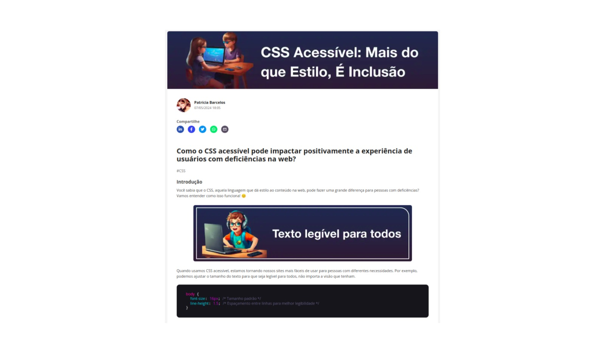

  

# Projeto criação de artigo utilizando IA e revisão humana

 > ℹ️ **NOTE:** Este é o repositório desenvolvido durante o curso da [DIO](https://dio.me).

Projeto com o objetivo de gerar um artigo técnico com um layout rico, leitura agradável e com foco em promover autoridade técnica.

<a href="https://www.dio.me/articles/como-o-css-acessivel-pode-impactar-positivamente-a-experiencia-de-usuarios-com-deficiencias-na-web" title="View PDF now"> 📕Clique aqui para ler o artigo</a>

## 💻 Tecnologias utilizadas no projeto

- [ChatGPT](https://chat.openai.com/) - para título e conteúdo
- [Lexica.art](https://lexica.art/) - para gerar imagens
- [Google Slides](https://www.google.com/intl/pt-BR/slides/about/) - Para formatação de banners e Layouts
- [Remove.bg](https://www.remove.bg/pt-br/upload) -  Para remover o fundo da imagem

## 📄 Prompts e ferramentas

ChatGPT：

|   Ação   | prompt                                                                                                                                                                                                                                                                         |
| :------: | ------------------------------------------------------------------------------------------------------------------------------------------------------------------------------------------------------------------------------------------------------------------------------ |
|  título  | Crie 10 headlines curtas para nomes de artigos sobre o assunto Acessibilidade Digital com CSS                                                                                                                                                                           |
| conteúdo | Escreva um artigo em blocos explicando sobre Como o CSS acessível pode impactar positivamente a experiência de usuários com deficiências na web. Siga as regras abaixo.

Lexica.art：

- No léxica utilizamos o acervo público de imagens geradas por outras pessoas, os termos de pesquisa que utilizei foram:

• child on computer

## ✨ Features

- Conteúdo gerado via ChatGPT
- Imagens do acervo público geradas via Lexica.art

## 📚 Materiais

- Imagens utilizadas em `assets`

